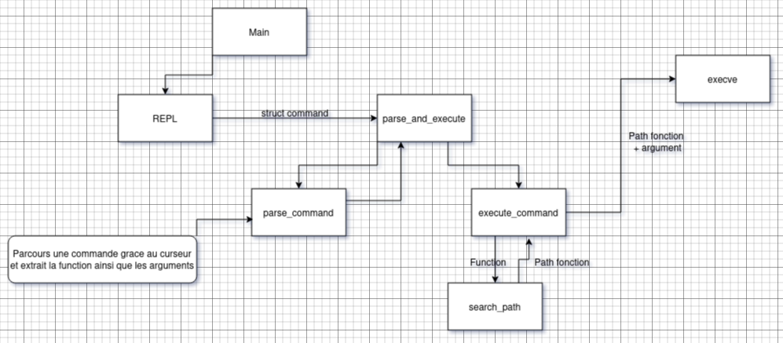

# Rapport SAE 3.03 - Système mbash
-> https://github.com/Baudoin-Mathieu/mbash

## Contexte

Cette SAE consiste à créer un interpréteur de commandes simplifié en C, appelé `mbash`, qui permet d'exécuter des commandes système tout en gérant l'historique des commandes, les opérations de base du shell (comme `cd`, `exit`, `history`) et quelques autres fonctionnalités.

## Objectif

L'objectif de ce projet est de développer un interpréteur de commandes en C qui simule un shell. Ce programme doit pouvoir exécuter des commandes simples et gérer des fonctionnalités de base comme la gestion de l'historique, et le déplacement dans l'arborescence de fichiers.

[//]: # (![Diagramme]&#40;mbash.png "Diagramme"&#41;)

## Partie 1 : Développement du projet

### 1. Structure du programme

Le programme est structuré autour de plusieurs modules permettant de gérer les commandes, les tokens, les variables d'environnement, et l'exécution de processus.

Les fonctionnalités principales incluent :

- **Parsing des commandes** : Chaque commande est analysée et découpée en tokens afin d'être interprétée et exécutée.
- **Gestion de l'historique** : Un système d'historique permet de naviguer dans les commandes précédemment saisies à l'aide des touches fléchées haut et bas.
- **Exécution des commandes** : Le programme peut exécuter des commandes systèmes en utilisant `execv` et gérer le fork d'un processus pour chaque commande.

### 2. Fonctionnalités principales

#### 2.1 Exécution des commandes

L'exécution des commandes se fait grâce à la fonction `do_exec_cmd`, qui utilise la fonction `execv` pour lancer un programme en tant que processus enfant.  
Le chemin du programme est recherché à travers les répertoires définis dans la variable d'environnement `PATH`.

#### 2.2 Gestion de l'historique

L'historique des commandes permet à l'utilisateur de revenir sur ses précédentes entrées en utilisant les touches fléchées haut et bas.  
Le programme conserve les dernières 100 commandes dans un tableau circulaire. Lors de l'exécution de la commande `history`, l'ensemble des commandes passées est affiché à l'écran.

#### 2.3 Autocomplétion

Une fonctionnalité d'autocomplétion permet de proposer des noms de fichiers et de répertoires présents dans le répertoire courant lorsque l'utilisateur appuie sur la touche `Tab`.  
Cela aide l'utilisateur à compléter les chemins de fichiers sans avoir à les taper entièrement.

#### 2.4 Commande `cd`

Le programme permet de changer de répertoire à l'aide de la commande `cd`.  
Cette commande modifie le répertoire de travail actuel du processus.

#### 2.5 Commande `exit`

La commande `exit` permet de quitter l'interpréteur de commandes.  
Elle met fin au programme.

## Partie 2 : Déploiement

### Coté serveur

#### Mise sous package Debian

Création un répertoire de déploiement
Et execution avec : `dpkg-buildpackage -us -uc`

Test avec : `sudo dpkg -i mbash.deb` ;

#### Signature

Génération de clé avec `gpg` : `gpg --full-generate-key`
On applique les clés avec : `debsign -k <ID_CLÉ> mbash-1.0.dsc`

#### Mise en ligne

Mise en ligne avec `reprepro` sur un serveur Apache
Créer l'arborescence du dépôt et configurer le fichier `distributions`.
Ajouter des paquets au dépôt : `reprepro -b ~/depot_debian includedeb buster ~/depot_debian/incoming/mbash-1.0.deb`
Configurer un serveur Apache pour servir le dépôt.

### Coté client

Ajouter le dépôt à la liste des sources sur la machines cliente : `deb http://<serveur>/mbash buster main`
Installer le paquets depuis le dépôt avec `apt`.

## Conclusion

Le projet `mbash` permet de simuler un interpréteur de commandes basique avec une gestion de l'historique.  
Il sert de base pour comprendre la gestion des processus sous Unix et les fonctionnalités d'un shell.  
La mise en œuvre a permis d'apprendre à manipuler les processus, les signaux et la gestion des entrées/sorties en C ainsi que la distribution de package debian.

### Code source

Le code source du projet est disponible dans le fichier `mbash.c`.